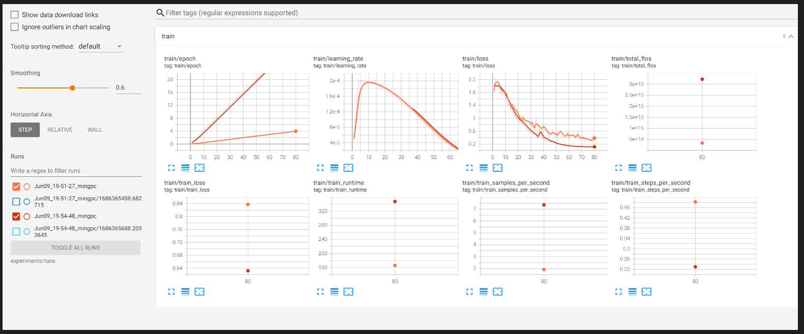
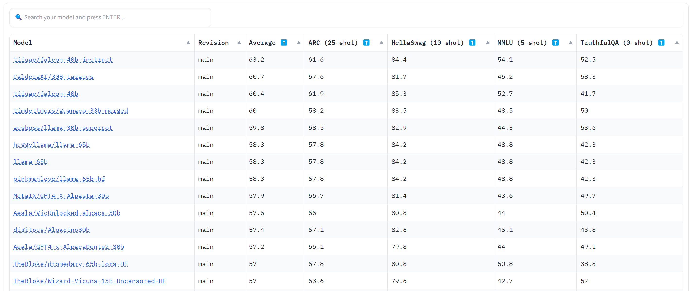
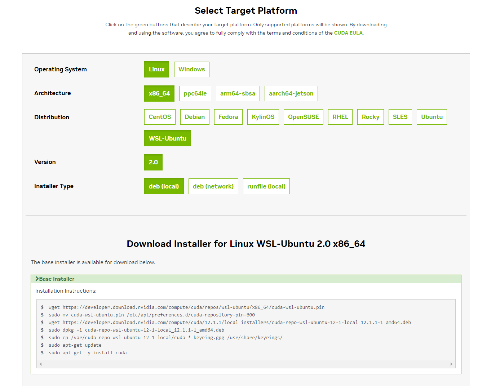

# Finetune Falcon 7B LLM on a Single RTX 4090 on WSL


I have a single RTX 4090 installed on Windows Host. I am using Ubuntu 22.04 as a Guest running in WSL2 to finetune the 7B model. This is a formidable task because recompile bitsandbytes is needed.

**QLoRA on WSL**

I use QLoRA to fit the large LLM into a Single GPU:https://arxiv.org/abs/2305.14314. I need to compile bitsandbytes to make it work on WSL.
- WSL guest needs to leverage host's GPU. The GPU driver installed on host, the CUDA Development Kit needs to install on Guest. Default CUDA Development Kit contains GPU driver. It won't work if install the default CUDA Development Kit.
- Install it using below command works:
```
wget https://developer.download.nvidia.com/compute/cuda/12.1.1/local_installers/cuda_12.1.1_530.30.02_linux.run
sudo sh cuda_12.1.1_530.30.02_linux.run
```

- Update system path and variable in ~/.bashrc. Note the LD_LIBRARY_PATH needs to contains two libraries, one is the stub refer to the host, the other one is the one installed in local
```
export PATH="/usr/local/cuda-12.1/bin:$PATH"
export LD_LIBRARY_PATH="/usr/local/cuda-12.1/lib64:/usr/lib/wsl/lib"
```

- double check to confirm NVCC is installed and fully working

- Then I can compile bitsandbytes with GPU support

**Training**

- only ~0.1% of all parameters are trained, the performance was amazing. Thanks again for the LoRA and QLoRA
- [this notebook contains training script](fintune-falcon/qlora.ipynb), it's here in the repo: ./fintune-falcon/qlora.ipynb
- I am able to push batch size to 8. I think 16 may also work. The smoother loss is the batch_size=8:



**Appendix**

- Falcon 40 B is at the top of Open LLM Leaderborad at the time I attempt the finetuning. And it's a commercial free license.


- If follow this CUDA Toolkit installation (recommended by Nvidia), it installs the toolkit, but no NVCC driver. So it doesn't work. https://developer.nvidia.com/cuda-downloads?target_os=Linux&target_arch=x86_64&Distribution=WSL-Ubuntu&target_version=2.0&target_type=deb_local


**Credits**

- https://www.mlexpert.io/prompt-engineering/fine-tuning-llm-on-custom-dataset-with-qlora
- https://github.com/TimDettmers/bitsandbytes